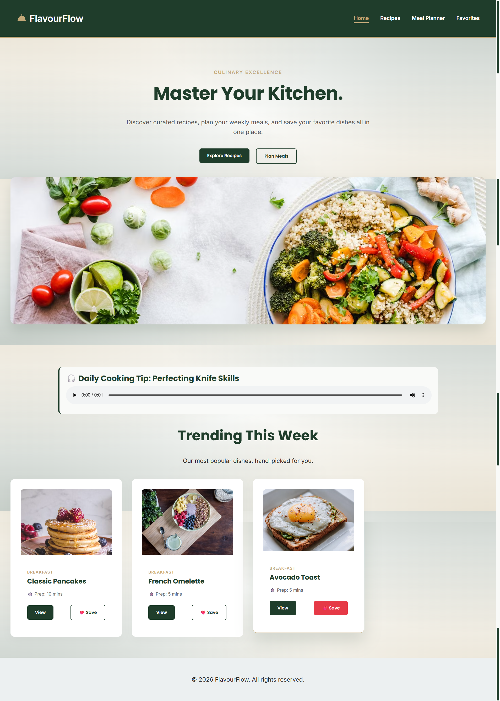
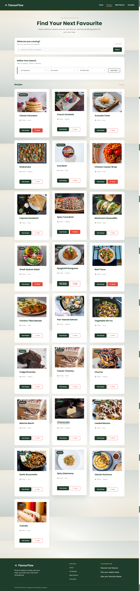
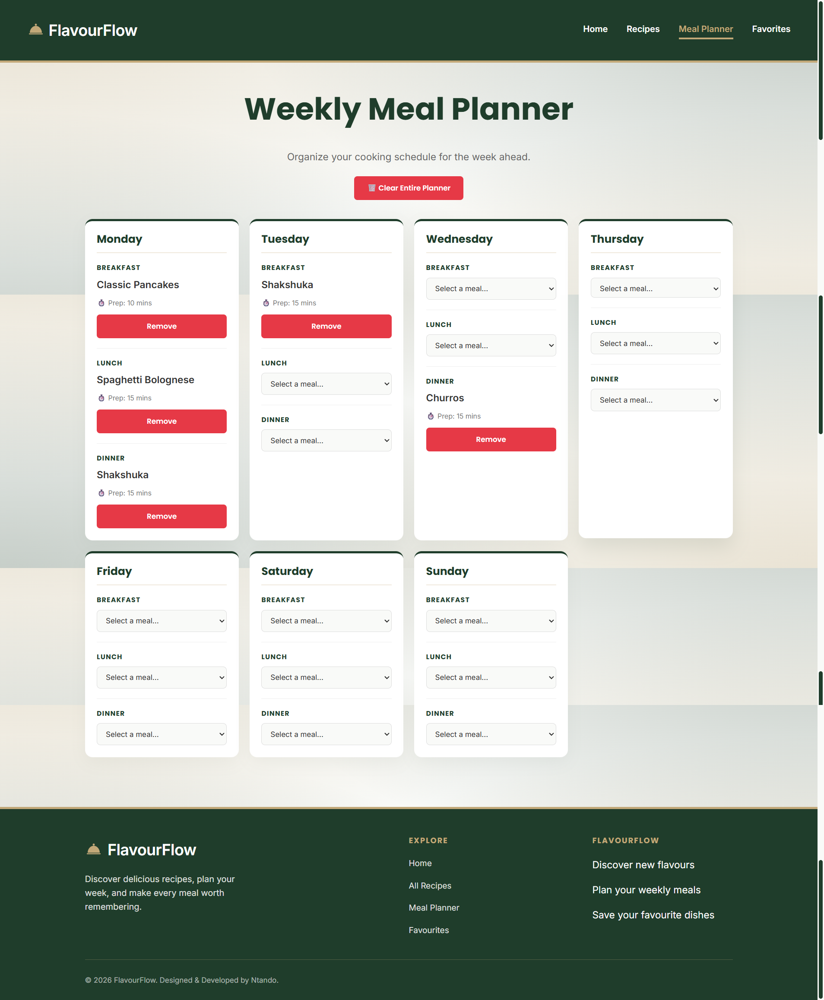
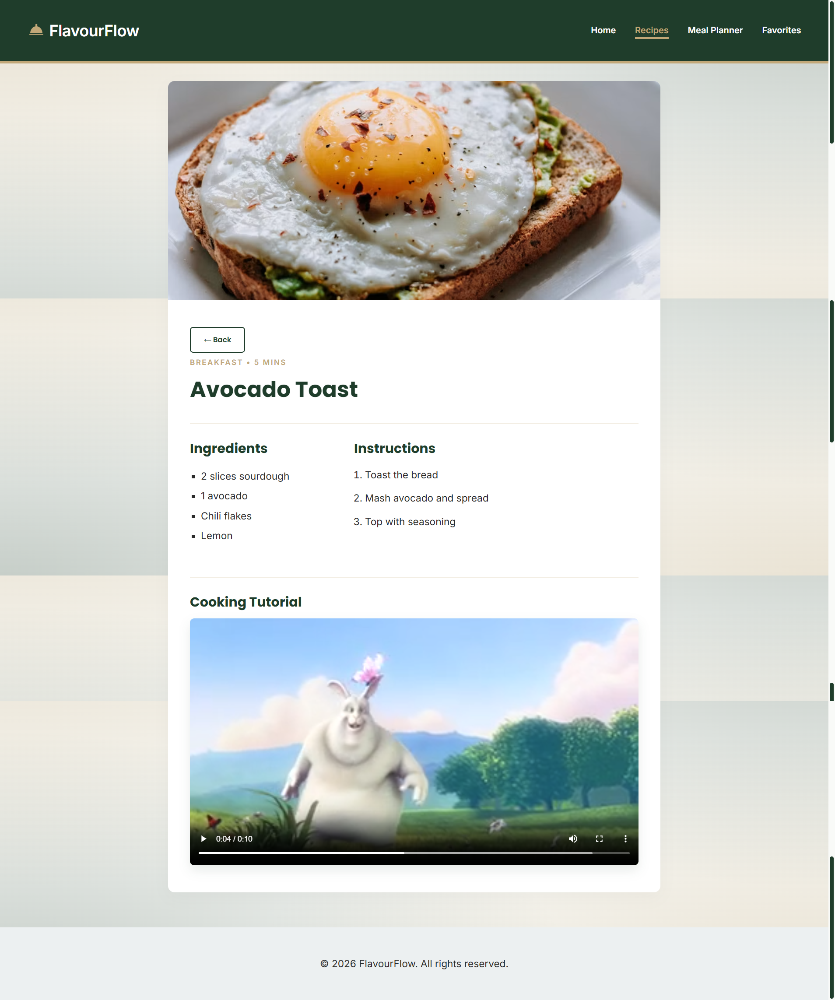
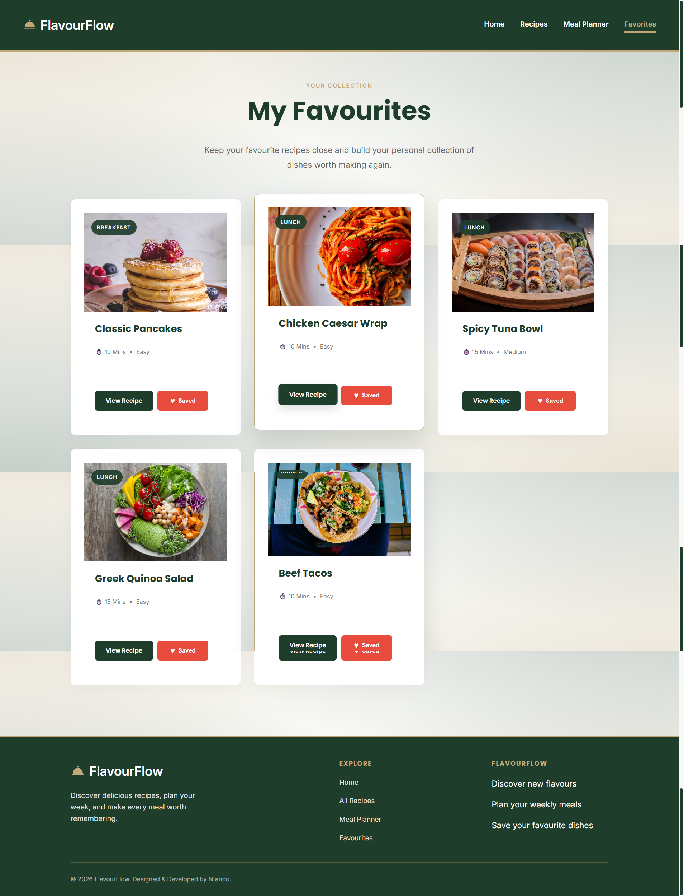

# RecipeHub - React Capstone Project

RecipeHub is a responsive, feature-rich React application built to help users discover curated recipes, manage weekly meal schedules, and seamlessly track their favorite dishes.

## Core Features

- **Dynamic Recipe Discovery:** Robust filtering system sorting by category, cuisine, and difficulty, combined with real-time text search across titles and ingredients.
- **Persistent Weekly Meal Planner:** A 7-day, 3-slot (Breakfast, Lunch, Dinner) scheduling interface.
- **Global Favorites Management:** Seamlessly save and unsave recipes, with instant UI updates across the navigation bar and recipe cards.
- **Multimedia Integration:** Native HTML5 audio and video components delivering daily cooking tips and recipe tutorials.
- **Simulated Asynchronous Data:** Replicates API latency using `useEffect` and `setTimeout`, featuring explicit loading spinners and error boundary states.

## Tech Stack

- **React.js** for UI development
- **React Router DOM** for dynamic, client-side routing
- **CSS Modules** for scoped, component-level styling
- **LocalStorage API** for client-side data persistence
- **PropTypes** for strict type checking

## Routing Details

The application utilizes `react-router-dom` to manage distinct views without page reloads:

- `/` - **Home:** Features a hero banner, daily audio tip, and trending recipes.
- `/recipes` - **RecipesPage:** The main hub for searching, filtering, and displaying the recipe catalog.
- `/recipes/:id` - **RecipeDetail:** Dynamic route rendering specific recipe data and video tutorials based on the URL parameter.
- `/meal-planner` - **MealPlannerPage:** The interactive weekly scheduling tool.
- `/favorites` - **FavoritesPage:** Displays all recipes saved to the global context.
- `*` - **NotFound:** A 404 catch-all route for invalid URLs.

## State Management & Architecture

The application employs a tiered state management approach:

1. **Global State (`FavoritesContext`):** Utilizes the React Context API to manage the `favorites` array globally. This eliminates prop drilling, allowing the `RecipeCard` to toggle states and the `Navbar` to display favorite counts simultaneously.
2. **Persistent State (`localStorage`):** The `MealPlannerPage` initializes state from local storage. A `useEffect` hook monitors the `planner` object, automatically serializing and saving data whenever a meal is assigned or removed.
3. **Local UI State:** Search queries, dropdown selections, and conditional rendering flags (`isLoading`, `hasError`) remain scoped to `RecipesPage` to prevent unnecessary app-wide re-renders.

## Project Structure

```text
src/
├── components/
│   ├── Media/        # AudioPlayer, VideoPlayer
│   ├── Recipe/       # RecipeCard, RecipeList, RecipeFilter
│   └── UI/           # Button, Card, SearchBar, Modal, Loading
├── context/          # FavoritesContext
├── data/             # recipesData (Mock JSON)
├── pages/            # Home, RecipesPage, MealPlannerPage, RecipeDetail
├── App.jsx           # Root Router & Context Provider
└── main.jsx          # React DOM entry point
```

## ⚙️ Installation & Setup

1. Clone the repository:
   ```bash
   git clone [https://github.com/Umuzi-skillslab/react-recipe-app-Ntando-Mo.git](https://github.com/Umuzi-skillslab/react-recipe-app-Ntando-Mo.git)
   ```
2. Navigate to the project directory:
   ```bash
   cd recipe-app
   ```
3. Install dependencies:
   ```bash
   npm install
   ```
4. Start the development server:
   ```bash
   npm run dev
   ```

## Future Enhancements

- **User Authentication:** Implementing Firebase to allow multiple users to maintain separate planners.
- **API Integration:** Swapping the mock data file for a live connection to the Spoonacular or Edamam API.
- **Shopping List Generator:** Automatically compiling a checklist of ingredients based on the active weekly meal plan.

## Screenshots
will add them as soon as I am done with the UI
1. 
2. 
3. 
4. 
5. 
